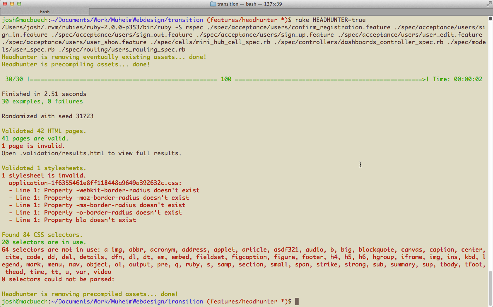

# Headhunter


[](http://badge.fury.io/rb/headhunter)
[](https://codeclimate.com/github/jmuheim/headhunter)
[](https://travis-ci.org/jmuheim/headhunter)
[](https://bitdeli.com/free "Bitdeli Badge")

Headhunter is an HTML and CSS validation tool that injects itself into your Rails feature tests and auto**magic**ally checks all your generated HTML and CSS for validity.

In addition, it also looks out for unused (and therefore superfluous) CSS selectors.

This is all done **locally**, so no external service is used.

## How to use

Add Headhunter to your `Gemfile`:

```ruby
group :test do
  gem 'headhunter'
end
```

Just set the environment variable `HEADHUNTER` to `true` when running your tests, e.g.:

```
$ rake HEADHUNTER=true
$ HEADHUNTER=true rspec
$ HEADHUNTER=true cucumber
```

Headhunter doesn't keep your tests from passing if invalid HTML or unused CSS is found. Instead it displays a short statistic after the tests are run.



## How it works

Headhunter registers itself as middleware in the Rack stack and triggers validation for every HTML response. Headhunter also iterates over every `.css` file and triggers its validation. In addition, it checks which CSS selectors are really used in the HTML pages to see whether there exist any unused CSS definitions.

For being able to validate CSS, `rake assets:precompile` is triggered at the beginning of running tests. This may slow down starting your tests a bit. **Notice: all precompiled assets will be removed after the tests have finished!**

**Please keep in mind that this is a pretty early release. I didn't have the possibility to test it extensively yet, so there surely are a lot of things left to do. You are highly welcome to file issues, add feature requests and open pull requests.**

## Requirements

**[Tidy HTML](http://tidy.sourceforge.net/)** should be installed on a typical OSX and Linux installation already - you're not developing on a Windows machine, are you?! If you want to validate HTML5 (and you should want to!), install the HTML5 version like described here: [homebrew tidy html5](http://techblog.willshouse.com/2013/10/21/homebrew-tidy-html5/).

You need a **Java Runtime Environment** to run CSS validation. This should normally already be available on OSX and Linux machines, too. A local copy ([`css-validator.jar`](http://jigsaw.w3.org/css-validator/DOWNLOAD.html)) of the [W3 CSS Validation Service](http://jigsaw.w3.org/css-validator/) is used.

## Known issues and future plans

- It would be nice to use Rails' own assets compilation that's executed when the first JavaScript test is run. Anyone has an idea on how to do this?
- HTML and CSS sources should not be uglified, to allow more concise error messages
- Would be really useful to have the concrete URL of every validated HTML page. But can't find a way to extract it from Rack response.
- There are not tests yet. I first want to see whether this gem would be appreciated by the community, and if so, I will definitely add tests.
- Didn't try this with AJAX requests yet. Would be great if such responses would be validated, too!
- In feature tests, the same views are getting rendered again and again. These same sources shouldn't be validated over and over again!
- More configuration options needed! CSS1, CSS2, CSS2.1, CSS3! XHTML, HTML5, etc.
- Better output needed! With context lines, etc.
- Look out for multiple used IDs on the same page and raise error!
- Look out for invalid tags and raise error (tidy doesn't seem to do this?!)!

## Disclaimer

Headhunter is heavily inspired by Aanand Prasad's [Deadweight gem](https://github.com/aanand/deadweight), Eric Beland's [HTML Validation gem](https://github.com/ericbeland/html_validation) and Unboxed Consulting's [be\_valid\_asset gem](https://github.com/unboxed/be_valid_asset). Thank you for your pioneering work!

**USE THIS GEM AT YOUR OWN RISK!**

All provided functionality is provided "as is".


